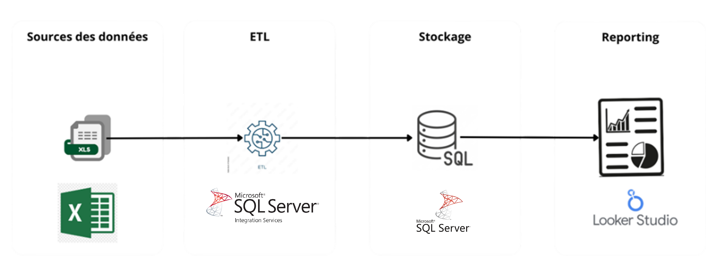
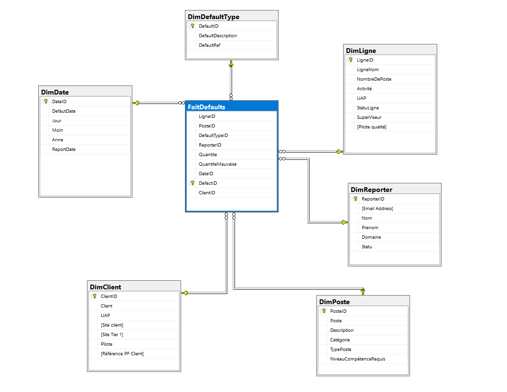

# Manufacturing Defect Analytics – Data Warehouse & Dashboard


This project is an anonymized adaptation of my **Final Year Project (PFE)**:  
**“Development of a Decision-Making Solution for Defective Parts Analysis”**  

It demonstrates my ability to design and implement a **full Business Intelligence pipeline** using the **Kimball methodology**, from data collection to visualization.

---

## 🚀 Problem Statement
In manufacturing, detecting and analyzing defective parts is essential to ensure product quality and reduce costs.  
Before this project, defect data was collected manually and scattered, making it difficult to:

- Identify recurring issues across production lines  
- Monitor defect trends over time  
- Provide actionable KPIs for managers  

---

## 💡 Solution
The project implements a **decision-making BI solution** with the following components:

1. **Data Source**: Operators enter defect reports via **Google Forms/Sheets**  
2. **ETL Pipeline**:  
   - Built in **SSIS** (SQL Server Integration Services)  
   - Extracts raw form data, cleans it, and loads it into the warehouse  
   - Demo version in **Python/SQLite** (synthetic data)  
3. **Data Warehouse**:  
   - Modeled with **Kimball star schema**  
   - **Fact table**: `FaitDefaults` (defect events)  
   - **Dimensions**: Date, Line, Workstation, Defect Type, Reporter  
4. **Visualization**:  
   - Dashboards in **Looker Studio** with KPIs:  
     - Total Defects & Defect Rate %  
     - Top 5 Lines by Defects  
     - Top 5 Defect Types  
     - Trends over time  
     - Reporter/Shift analysis  
5. **Web Layer (Optional)**:  
   - MVC prototype using **XAMPP** to view KPIs in a simple web interface  

---

## 🧭 Architecture & Data Model

### Architecture Diagram


### Data Warehouse Star Schema


---
## ⚙️ Quickstart (Demo with Python + SQLite)
```bash
# Clone repo
git clone https://github.com/<your-username>/manufacturing-defect-analytics.git
cd manufacturing-defect-analytics

# Install dependencies
pip install -r requirements.txt

# Run ETL (loads sample data into SQLite)
python src/etl/python/sheets_to_sql.py --preview
```

---

## 📊 Example Dashboard (Looker Studio)
📌 Add screenshots in `/docs/images/` (make sure to anonymize).  
- KPI cards for defects & defect rates.  
- Bar charts for top lines and defect types.  
- Time series of defect rates.  
- Drilldowns by reporter and shift.  

---

## 🏆 Results & Impact
- **Centralized data warehouse** for defect reporting.  
- **Automated ETL** reduced manual data preparation.  
- **Dashboards** enabled managers to quickly identify high-risk lines and recurring defects.  
- Improved **decision-making** with reliable KPIs.

---

## 🔮 Future Improvements
- Add **predictive analytics** (ML model to forecast defect probability).  
- Integrate **natural language queries** for easier exploration.  
- Enhance **web interface** with role-based access.

---

## 🛠️ Tech Stack
- **ETL**: SSIS (demo in Python/SQLite)  
- **Database**: SQL Server / Azure SQL (demo in SQLite)  
- **Visualization**: Looker Studio (specs provided)  
- **Web App**: PHP (XAMPP MVC prototype)  
- **Languages**: SQL, Python

---

## 📝 License
This project is under the MIT License.
